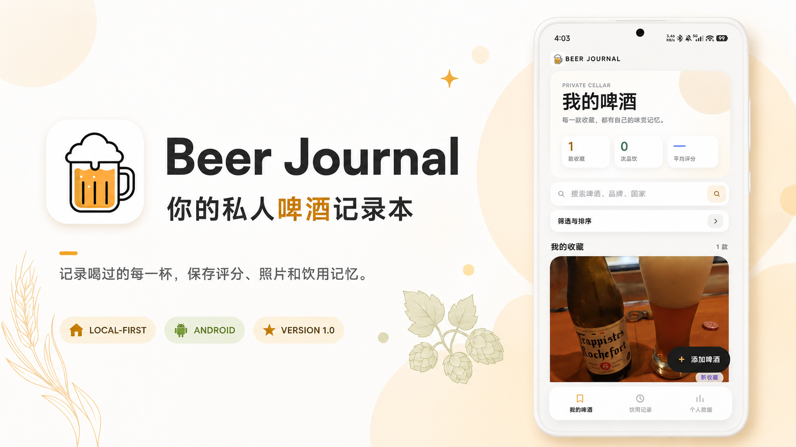
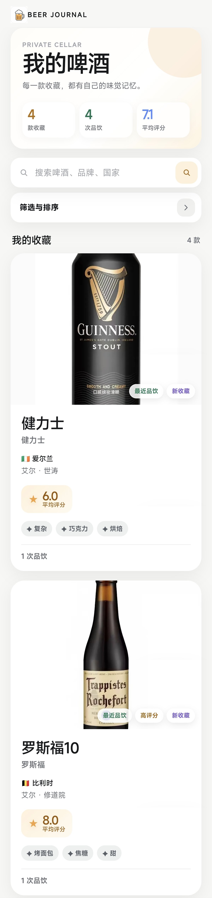
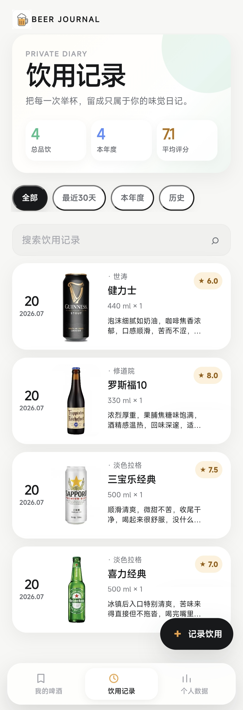
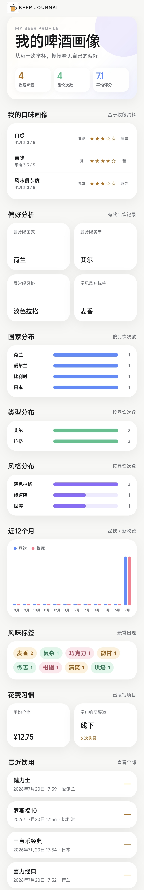
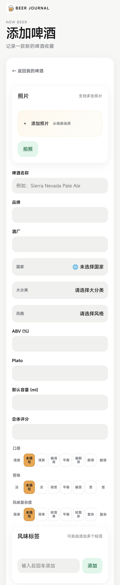
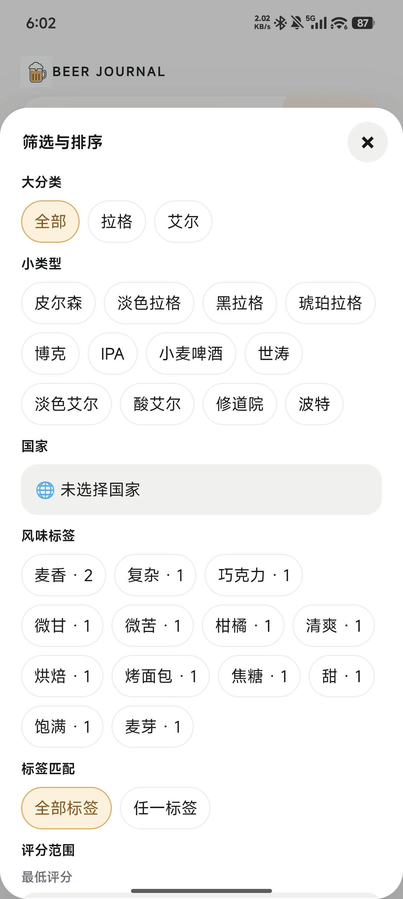

<div align="center">



# Beer Journal

### 一款专注个人记录的本地啤酒日志 App

记录喝过的每一杯，保存照片、评分、标签和饮用回忆。无需账号，数据默认留在你的 Android 手机里。

[](https://github.com/Eddie135/Beer-Journal/releases/tag/v1.0.0)
[](https://github.com/Eddie135/Beer-Journal/releases/tag/v1.0.0)
[](https://github.com/Eddie135/Beer-Journal)

**[下载 Beer Journal 1.0](https://github.com/Eddie135/Beer-Journal/releases/download/v1.0.0/Beer-Journal-v1.0.0-release.apk)**

简体中文优先 · English 简版入口后续补充

</div>

## 🍺 这是一个什么 App？

Beer Journal 是一款完全离线的 Android 啤酒记录软件。它适合想认真记住自己喝过什么、喜欢什么，也想在下次打开时快速找回那段味道的人。

## ✨ 功能预览

| 我的收藏 | 标签与筛选 | 照片与回忆 | 个人统计 |
| --- | --- | --- | --- |
| 记录名称、品牌、国家、类型和评分，建立自己的啤酒收藏。 | 自定义风味标签，按国家、类型、评分和标签组合查找。 | 保存多张本地照片，设置封面，保留每次开瓶时的现场感。 | 查看饮用次数、瓶数、平均分、国家分布和最近记录。 |

## 📱 实际界面

下面是 Beer Journal 1.0 的真实界面截图。展示框统一为相同高度，手机端可以横向滑动查看。

<table>
<tr>
<td align="center"><br><sub><b>我的啤酒</b><br>集中管理你的收藏啤酒</sub></td>
<td align="center"><br><sub><b>饮用记录</b><br>按时间记录每一次实际品饮</sub></td>
<td align="center"><br><sub><b>个人数据</b><br>查看口味偏好与统计结果</sub></td>
<td align="center"><br><sub><b>添加啤酒</b><br>快速录入新的啤酒资料</sub></td>
<td align="center"><br><sub><b>筛选与排序</b><br>按分类、标签、评分快速查找</sub></td>
</tr>
</table>

## 🧭 这款 App 能做什么？

- 新建啤酒档案：名称、品牌、国家、大分类、小类型、评分和个人感想都能留下。
- 记录每次饮用：时间、地点、容量、瓶数、价格、本次评分和品饮笔记分别保存。
- 自定义风味标签：自由添加、编辑和删除标签，慢慢整理自己的口味词典。
- 搜索、筛选和排序：按评分、类型、国家、标签、最近品饮或最新录入快速定位。
- 保存照片：啤酒和饮用记录都支持多图、封面、本地压缩和照片恢复。
- 查看个人统计：了解收藏数量、饮用次数、总瓶数、平均评分和国家分布。
- 回收站恢复：误删的 Beer、Tasting 和照片可以在本地回收站找回。
- JSON 备份与恢复：定期导出自己的记录，需要时再导入恢复。

## 🙌 适合谁？

- 想认真记录自己喝过哪些啤酒的人
- 不想依赖社交平台或注册账号的人
- 希望照片和记录都保存在本地的人
- 想按标签和评分回顾口味偏好的人

## 🚀 如何开始使用

1. 打开 [v1.0.0 Release](https://github.com/Eddie135/Beer-Journal/releases/tag/v1.0.0)，下载 APK。
2. 在 Android 手机上安装，打开后直接添加第一款啤酒。
3. 使用一段时间后，在 App 内导出 JSON 备份，为自己的记录留一份副本。

> 不需要账号，数据默认保存在本地。卸载 App 或清除应用数据会删除本机记录，请先导出备份。

## 📝 更新日志

### v1.0.0

- 首个正式本地离线版本发布
- 支持 Beer、Tasting、照片、标签、国家、分类和评分
- 支持搜索、组合筛选、排序、个人统计和回收站恢复
- 支持 JSON 备份与恢复

## 📚 文档与说明

项目范围、数据设计、隐私和安全说明集中放在 [`docs/`](docs/)；完整更新记录见 [`CHANGELOG.md`](CHANGELOG.md)。

## 🛠️ 开发者构建（可选）

普通用户不需要执行这一节。需要本地构建时：

```powershell
cd mobile
npm ci
npm test
npm run build
npx cap sync android
```

正式签名文件只保存在仓库外，项目不会把 keystore、用户数据或构建产物提交到 Git。

<div align="center">
<sub>Beer Journal · 把每一杯，留给未来的自己</sub>
</div>
