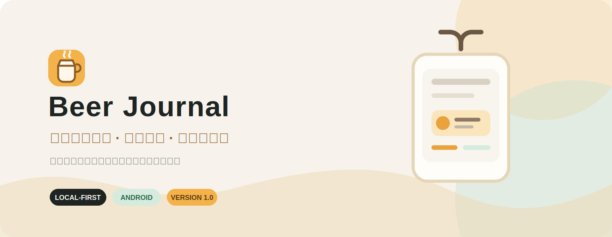
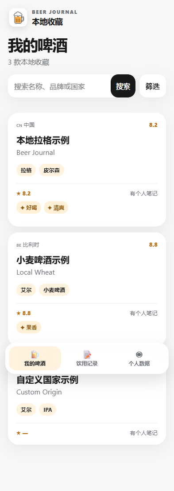
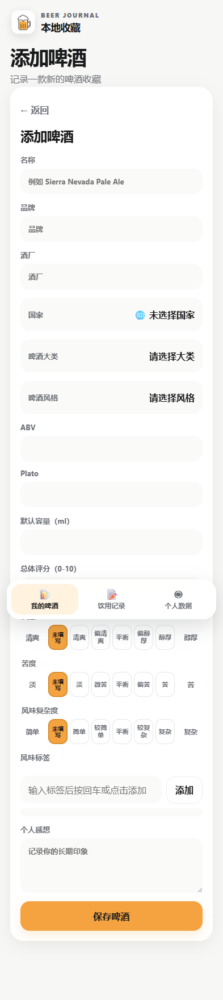
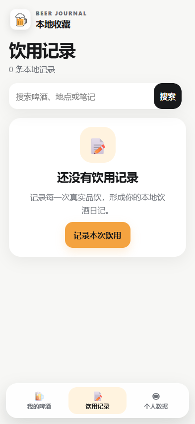
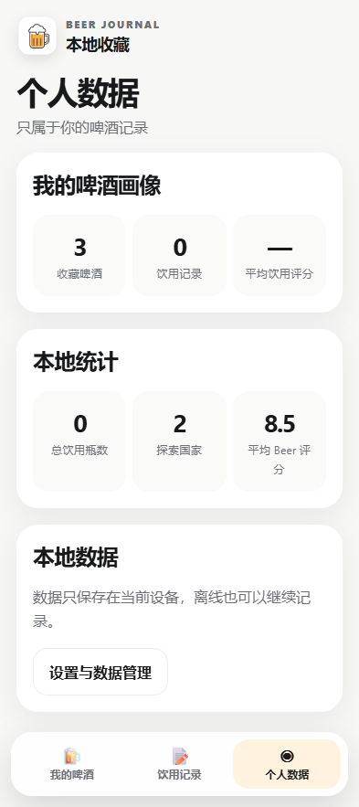
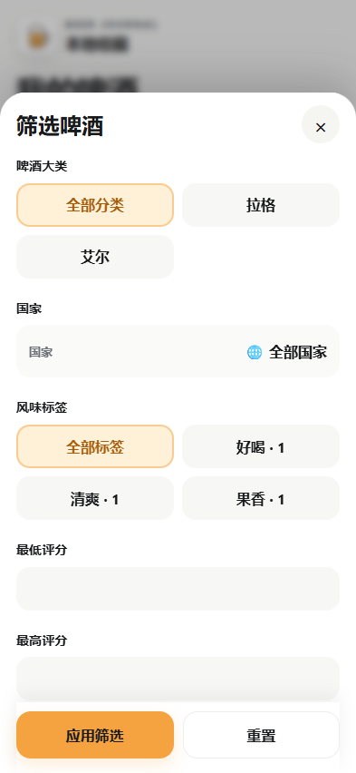

<div align="center">



# Beer Journal

### 一款专注个人记录的本地啤酒日志 App

不用账号，不用社交平台。把啤酒、照片和每次品饮，都安静地留在自己的手机里。

[](https://github.com/Eddie135/Beer-Journal/releases/tag/v1.0.0) [](https://github.com/Eddie135/Beer-Journal/releases/tag/v1.0.0) [](https://github.com/Eddie135/Beer-Journal)

**[下载 Beer Journal 1.0](https://github.com/Eddie135/Beer-Journal/releases/download/v1.0.0/Beer-Journal-v1.0.0-release.apk)**　·　[查看 GitHub Release](https://github.com/Eddie135/Beer-Journal/releases/tag/v1.0.0)

<sub>简体中文优先 · English 简版入口后续补充</sub>

</div>

## 🍺 这是什么？

Beer Journal 是一款完全离线的 Android 啤酒记录软件。

它适合那些想认真记住自己喝过什么、喜欢什么，也想在下次打开时快速找回这段体验的人。名称、国家、类型、评分、标签、照片和品饮笔记，都可以在本地慢慢积累。

## ✨ 功能预览

<table>
<tr>
<td width="25%" valign="top"><h3>🍺 我的收藏</h3><p>记录啤酒名称、品牌、国家、类型和自己的评分，建立一份只属于你的收藏。</p></td>
<td width="25%" valign="top"><h3>🏷️ 标签与筛选</h3><p>自由添加风味标签，按国家、类型、评分、标签组合筛选，找到真正合口味的那一杯。</p></td>
<td width="25%" valign="top"><h3>📷 照片与回忆</h3><p>保存多张本地照片，设置封面，自动压缩后仍保留每次开瓶时的现场感。</p></td>
<td width="25%" valign="top"><h3>📊 个人统计</h3><p>看看喝过多少款、来自哪些国家、平均评分和最近的品饮记录。</p></td>
</tr>
</table>

## 👀 看看它长什么样

下面是当前 1.0 的实际界面。图片位已经整理好，之后可以直接替换成新的宣传截图。

<table>
<tr>
<td></td>
<td></td>
<td></td>
<td></td>
<td></td>
</tr>
</table>

## 🧡 这款 App 能做什么

- 新建啤酒档案，记录名称、品牌、国家、大分类、小类型和评分。
- 为同一款啤酒记录多次真实品饮：时间、地点、容量、瓶数、价格、评分和笔记。
- 自定义风味标签，随时添加、编辑、删除，再用标签找回相关记录。
- 按评分、类型、国家、标签和品饮次数筛选，也可以按最新录入或最近品饮排序。
- 保存多张本地照片，设置封面，编辑时继续管理和恢复照片。
- 在个人数据页查看啤酒数量、饮用次数、瓶数、平均分和国家分布。
- 误删的 Beer、Tasting 和照片可以从回收站恢复。
- 导出 JSON 备份，需要时再导入恢复自己的记录。

## 🙋 适合谁

- 想认真记录自己喝过哪些啤酒的人
- 不想把个人口味交给社交平台的人
- 希望照片和记录都保存在本地的人
- 想按标签和评分回顾自己口味变化的人

## 🚀 如何开始使用

1. 打开 [v1.0.0 Release](https://github.com/Eddie135/Beer-Journal/releases/tag/v1.0.0)，下载 APK。
2. 在 Android 手机上安装，打开后直接添加第一款啤酒。
3. 用了一段时间后，在 App 内导出一份 JSON 备份，给自己的记录留个副本。

> 不需要账号，数据默认保存在本地。卸载 App 或清除应用数据会删除本机记录，请先备份。

## 📦 当前版本

**v1.0.0 · 首个正式本地离线版本**

- Android 7.0（API 24）及以上
- 正式包：`com.mybeerjournal.app`
- 数据库 Schema：4
- 当前没有账号、云同步和多设备共享

## 📝 更新日志

### v1.0.0

- 首个正式版本发布
- 支持 Beer、Tasting、照片、标签、国家、分类和五选项感官评分
- 支持搜索、组合筛选、排序、个人统计和回收站恢复
- 支持 JSON 备份与恢复
- 完成从网页版体验到本地离线 App 的迁移

完整说明见 [`CHANGELOG.md`](CHANGELOG.md)。

## 📚 文档与说明

产品范围、数据库设计、隐私和安全说明集中放在 [`docs/`](docs/) 与以下文件中：

[`隐私说明`](PRIVACY.md)　·　[`安全说明`](SECURITY.md)　·　[`数据库设计`](docs/DATABASE_DESIGN.md)　·　[`后续路线图`](docs/ROADMAP.md)

## 🛠️ 开发者构建（可选）

普通用户不需要执行这一节。需要本地构建时：

```powershell
cd mobile
npm ci
npm test
npm run build
npx cap sync android
```

Android 构建需要 JDK 21、Android SDK 和项目指定的 Gradle/Capacitor 依赖。正式签名文件只应保存在仓库外；项目不会把它们提交到 Git。

---

<div align="center">
<sub>Beer Journal · 把每一杯，留给未来的自己。</sub>
</div>
